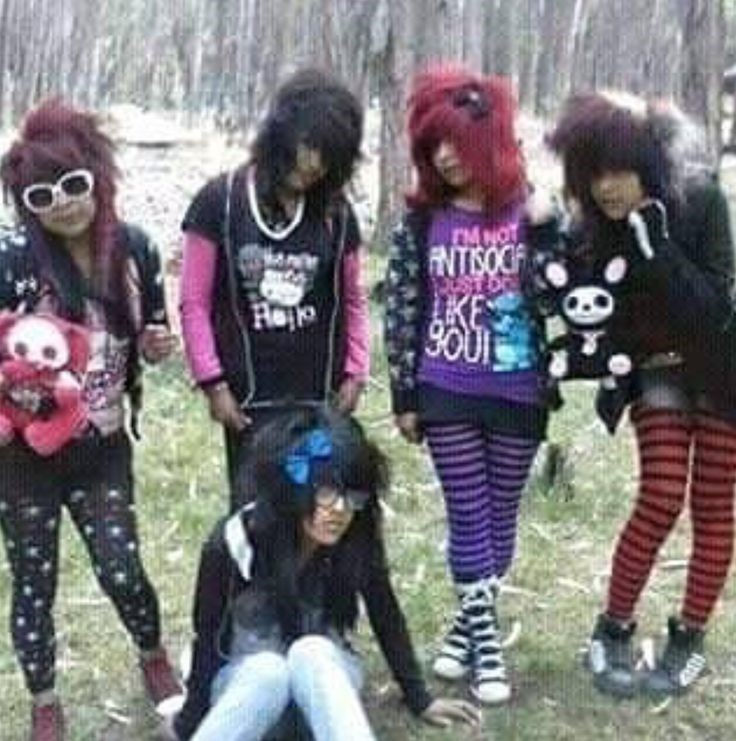
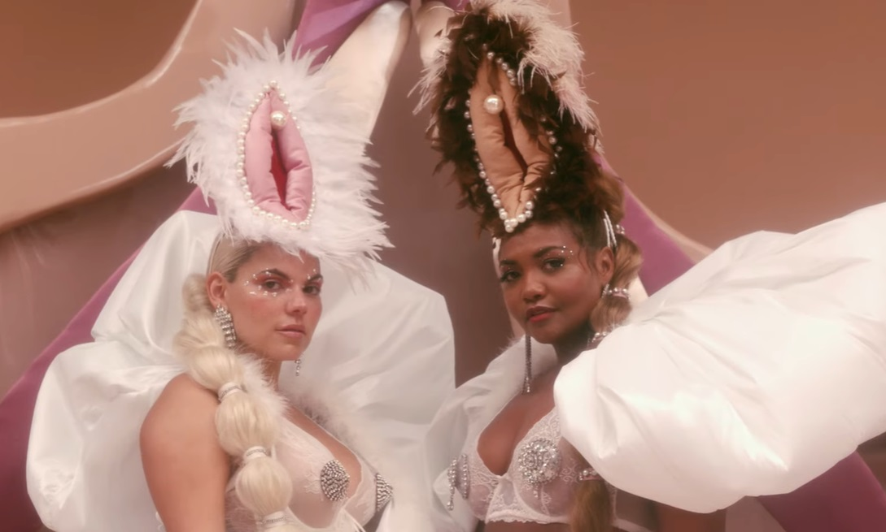

## Susan Sontag Notes on Camp

# 23  
In naive, or pure, Camp, the essential element is seriousness, a seriousness that fails. Of course, not all seriousness that fails can be redeemed as Camp. Only that which has the proper mixture of the exaggerated, the fantastic, the passionate, and the naive.  

  

Image of the 2000s emo scene style 

# 8  
Camp is a vision of the world in terms of style - but a particular kind of style. It is the love of the exaggerated, the "off", of things-being-what-they-are-not.  

 
![woman in large dress with several forms of female genitalia on the skirt](

Images from music video for the song Xanalá by Gaby Amarantos ft. Duda Beat
