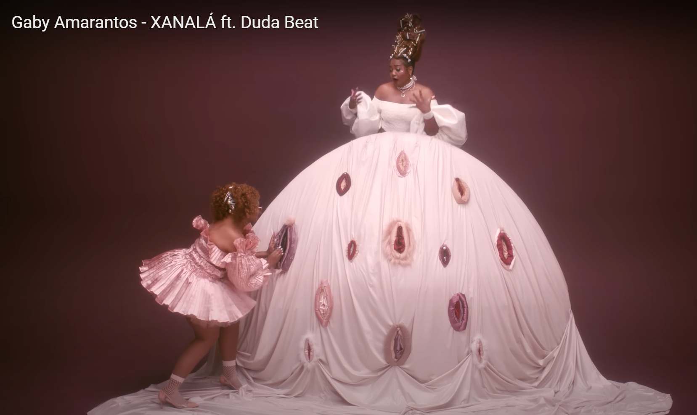

## Susan Sontag Notes on Camp

# 23  
In naive, or pure, Camp, the essential element is seriousness, a seriousness that fails. Of course, not all seriousness that fails can be redeemed as Camp. Only that which has the proper mixture of the exaggerated, the fantastic, the passionate, and the naive.  

  

Image of the 2000s emo scene style 

# 28  
Again, Camp is the attempt to do somehting extraordinary. But extraordinary in the sense, often, of being special, glamorous. (The curved line. The extravagant gesture.) Not extraordinary merely in the sense of effort.  

 

Images from music video for the song Xanalá by Gaby Amarantos ft. Duda Beat  

# 56  
Camp taste is a kind of love, love for human nature. It relishes, rather than judges, the little triumphs and awkward intensitites of "character." Camp taste identifies with what it is enjoying. People who share this sensibility are not laughing at the thing they label as "a camp," they're enjoying it. Camp is a **tender** feeling.  

  

Image from pinterest of a teenage werewolf
